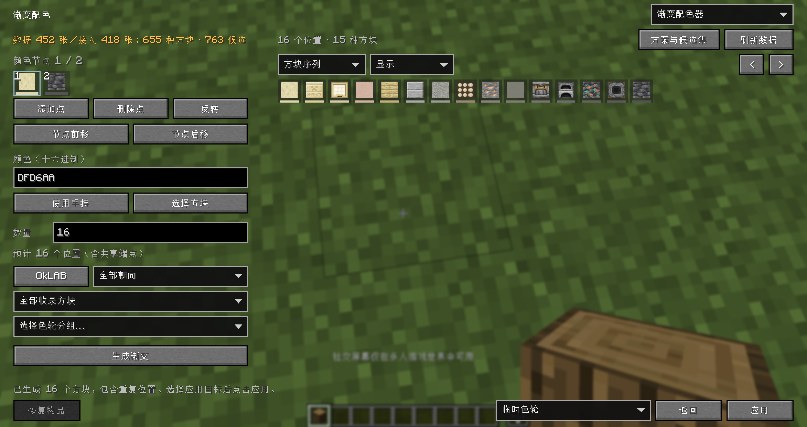
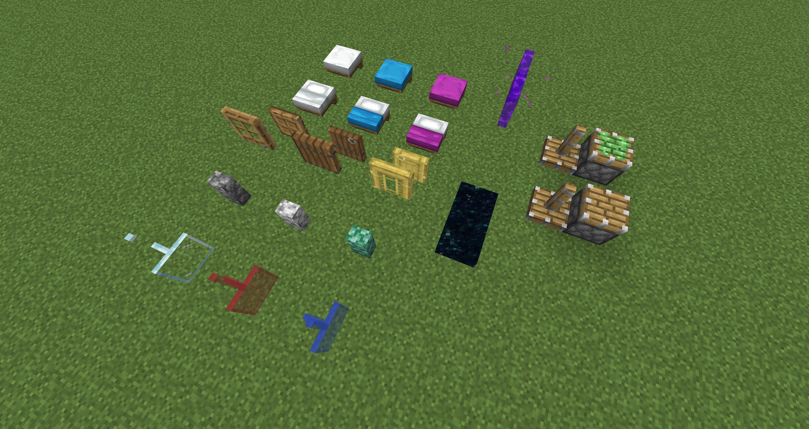
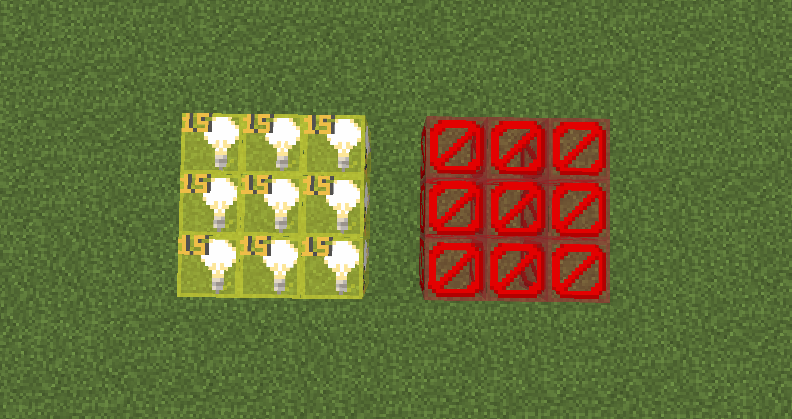

# Lorian’s Arch Orbit

> [!NOTE]
> This is a project by AI. If you mind this, please do not use this mod.

中文 · [English](README_en.md)

面向创造模式建筑师、地图作者和整合包团队的建筑辅助 Mod。支持 Minecraft 26.2、Fabric 与 NeoForge，主要功能均可独立开关并热重载。

## 基本功能

默认按 `O` 打开配置界面，按 `P` 打开编辑器。所有按键都可在 Minecraft 按键设置中修改。

除 **交互距离修改** 需服务端支持外，其余功能均为客户端功能。

### 一级/二级/临时物品色轮

- 默认按住 `R` 打开**一级色轮**，快速双按、第二次按住打开**二级色轮**，三连按、第三次按住打开**临时色轮**；滚轮切换手持物品，松开关闭
- 默认提供 **同类方块、同系列方块、颜色分类** 三种分组预设，也可以自己编辑分组、调整顺序，通过 **JSON/分享码** 分享给其他人
- 色轮会随窗口大小适配，可选择目标物品的位置及指示箭头样式；临时色轮可直接使用渐变配色的结果

详细使用方法见 [色轮使用教程](docs/PALETTE_GUIDE.md)。

### 渐变配色

- 选择颜色或方块作为节点，生成一组由浅到深、由暖到冷，或自己指定颜色过渡的方块渐变
- 支持选择方块不同面的纹理、替换并锁定单个结果，以及真实纹理平铺和前后结果对比
- 结果可应用到**临时色轮、物品栏或永久色轮分组**；渐变参数与候选集合也可以单独导入导出

详细使用方法见 [渐变配色教程](docs/GRADIENT_GUIDE.md)。配色数据来自 [HueBlocks](https://github.com/1280px/hueblocks)，首次使用需要下载，之后可使用有效缓存。

### 智能中键选取

- 中键短按保持原版选取，按住约 100 ms 后打开**候选轮盘**，选择周围方块
- 提供 **相邻模式、范围模式、上下文模式**，默认启用上下文模式

### 交互距离修改

- 默认按住 `G` 并使用鼠标滚轮调节 5–128 格交互距离，功能默认关闭
- 必须在客户端和服务端同时安装本 Mod，并由服务端配置授权

### 连接材质修复

- 补齐标准墙、玻璃板、床、门、箱子和伸出活塞的缺失连接面，以及地狱传送门四个边缘面、末地传送门五个非顶面的材质
- 各项修复均可在配置中独立开关；也包括关闭方块更新后，双箱被移除一半时的裸露连接面

### 不可见方块显示

- 默认按 `V` 同时切换屏障和光源方块的显示，可在配置中筛选类型

## 依赖

### Fabric

- [Fabric API](https://modrinth.com/mod/fabric-api)
- [Architectury API](https://modrinth.com/mod/architectury-api)
- [YetAnotherConfigLib (YACL)](https://modrinth.com/mod/yacl)：使用配置界面时需要
- [Mod Menu](https://modrinth.com/mod/modmenu)：可选，提供模组菜单入口

### NeoForge

- [Architectury API](https://modrinth.com/mod/architectury-api)
- [YetAnotherConfigLib (YACL)](https://modrinth.com/mod/yacl)：使用配置界面时需要

Fabric 端提供 **Radial** 可选兼容：两个轮盘绑定同一个键时，能打开本 Mod 色轮的情况下优先打开色轮，否则交给 Radial。也可以分别设置按键。

## 文档

### 中文

- [色轮使用教程](docs/PALETTE_GUIDE.md)
- [渐变配色教程](docs/GRADIENT_GUIDE.md)
- [配置文件与故障排查](CONFIGURATION.md)
- [HueBlocks 数据与预设优化说明](docs/HUEBLOCKS.md)
- [向上迁移指南](docs/UPWARD_MIGRATION.md)
- [向下迁移指南](docs/DOWNWARD_MIGRATION.md)
- [更新记录](UPDATE_NOTES.md)

### English

- [Color Wheel Guide](docs/PALETTE_GUIDE_en.md)
- [Gradient Guide](docs/GRADIENT_GUIDE_en.md)

## TODO

1. 结构方块显示
2. 自定义工具&命令轮盘

## 鸣谢

- [LotTweaks](https://github.com/aruma256/LotTweaks)：色轮、智能选取和交互距离的行为参考。
- [Visible Barriers](https://github.com/AmyMialeeMods/visiblebarriers)：不可见方块显示行为参考。
- [HueBlocks](https://github.com/1280px/hueblocks)：渐变配色功能参考及方块颜色数据来源。
- 可爱的酒狐。

## 协议

[MIT License](LICENSE).
