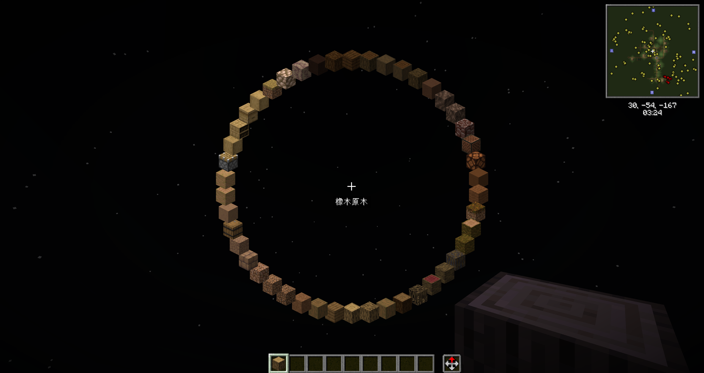
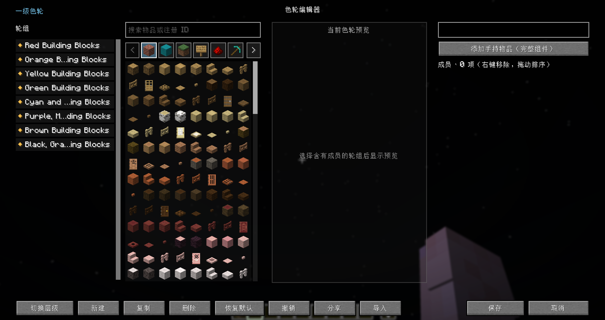
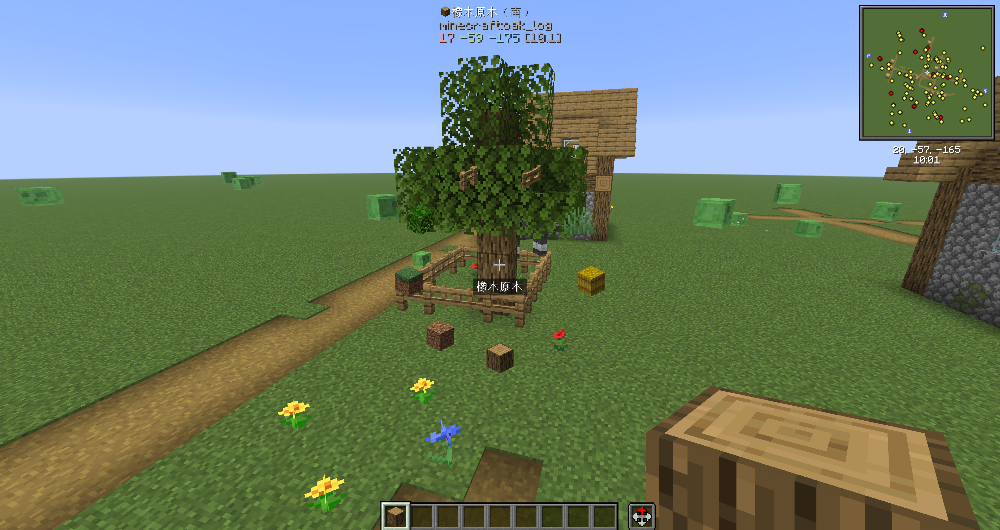
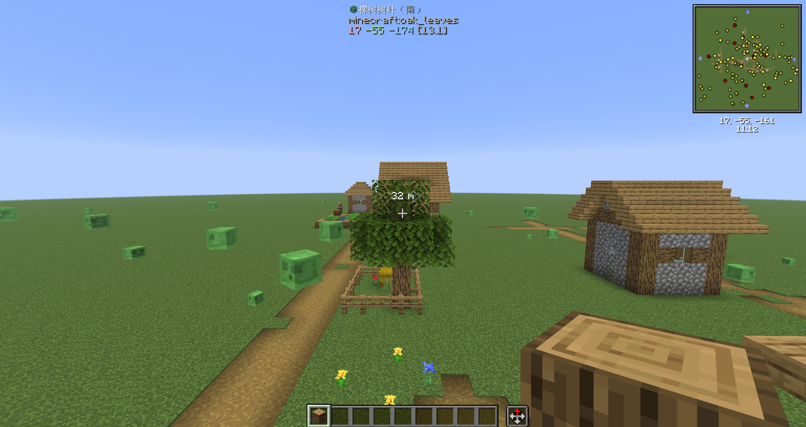
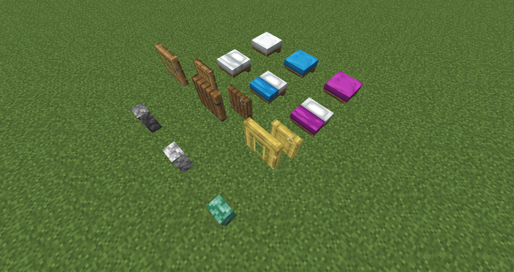
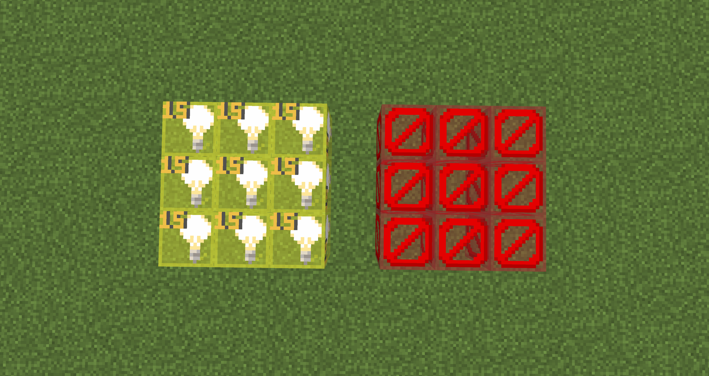

# Lorian’s Arch Orbit

> [!NOTE]
> This is a project by AI. If you mind this, please do not use this mod.

A building-assistance mod for Creative builders, map makers, and modpack teams. It supports Minecraft 26.2 on Fabric and NeoForge; each major feature can be toggled independently and hot-reloaded.

## Features

`O` opens the configuration screen by default. All keybindings can be changed in Minecraft's Controls settings.  
Except for **interaction reach modification**, all features are client-side.

### Primary / Secondary Item Color Wheels

- Hold `R` by default to open the **primary color wheel**; press `R` twice to open the **secondary color wheel**; use the scroll wheel to select items
- Press `P` by default to open the **visual color wheel editor**, which supports **JSON / share-code import and export**

### Smart Middle-Click Pick Block

- A short middle-click keeps the vanilla Pick Block behavior; holding for about 100 ms opens the **candidate wheel** to select nearby blocks
- The candidate wheel provides three modes: **adjacent mode, range mode, and context mode**; context mode is enabled by default

### Interaction Reach Modification

- Hold `G` by default and use the mouse scroll wheel to dynamically adjust the interaction reach from 5 to 128 blocks
- This feature requires the mod to be installed on both the client and the server, and is authorized by the server configuration
- This feature is disabled by default, because on the Fabric side Axiom's `Infinite Reach` can replace it

### Connected-Texture Fixes

- Completes the connected faces of standard walls, beds, and door models
- All fixes can be changed and reloaded dynamically in the configuration

### Invisible-Block Display

- Press `V` by default to toggle barriers and light blocks at the same time; the types can be filtered in the configuration

## Dependencies

### Fabric

- [Fabric API](https://modrinth.com/mod/fabric-api)
- [Mod Menu](https://modrinth.com/mod/modmenu)
- [Architectury API](https://modrinth.com/mod/architectury-api)
- [YetAnotherConfigLib (YACL)](https://modrinth.com/mod/yacl)

### NeoForge

- [Architectury API](https://modrinth.com/mod/architectury-api)
- [YetAnotherConfigLib (YACL)](https://modrinth.com/mod/yacl)

## Documentation

- [Configuration and troubleshooting](CONFIGURATION.md)
- [Upward migration guide](docs/UPWARD_MIGRATION.md)
- [Downward migration guide](docs/DOWNWARD_MIGRATION.md)
- [Update notes](UPDATE_NOTES.md)

## TODO

1. Chest connected-texture fixes
2. Structure-block display
3. Custom tool & command wheel

## Credits

- [LotTweaks](https://github.com/aruma256/LotTweaks): behavioral reference for the color wheel, smart pick, and interaction reach.
- [Visible Barriers](https://github.com/AmyMialeeMods/visiblebarriers): behavioral reference for invisible-block display.
- The lovely Jiu Hu (酒狐): contributed this project's icon.

## License

[MIT License](LICENSE).
