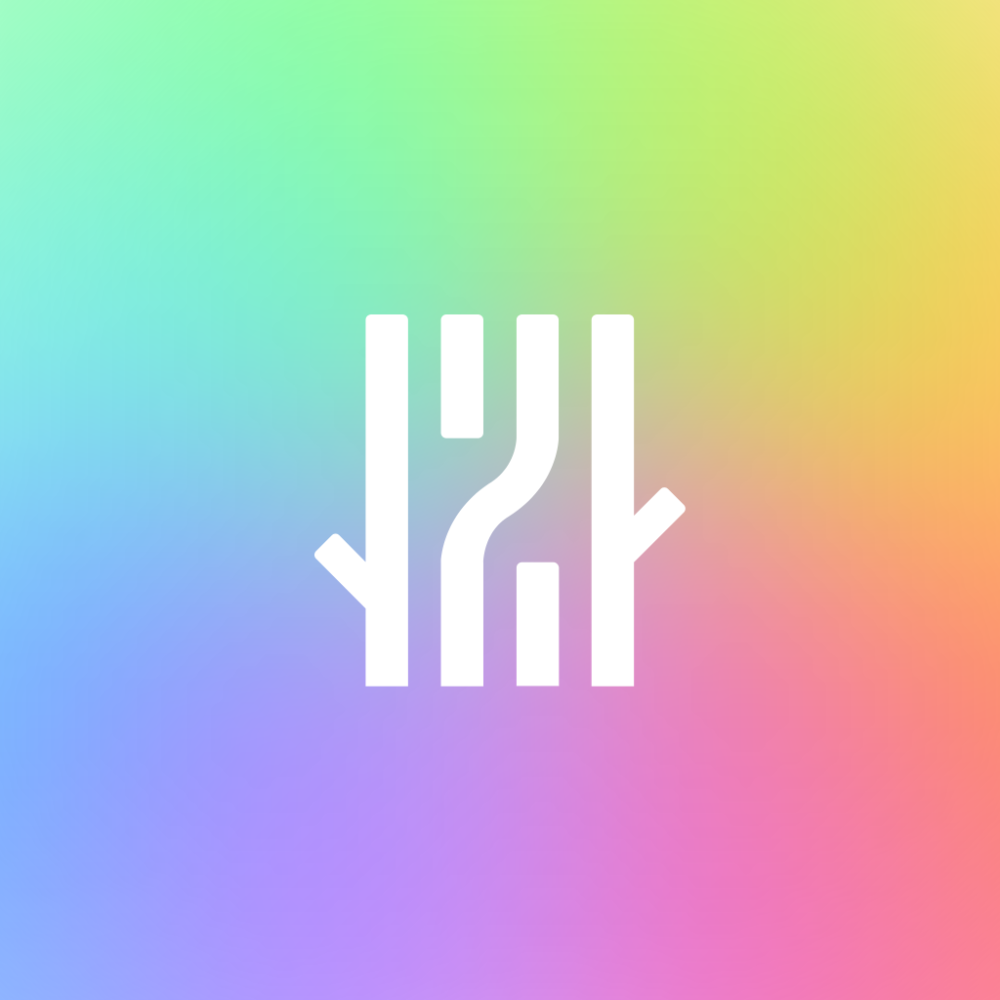

# Lorian’s Arch Orbit

> [!NOTE]
> This is a project by AI. If you mind this, please do not use this mod.

[中文](README.md) · English

A building-assistance mod for Creative builders, map makers, and modpack teams. It supports Minecraft 26.2 on Fabric and NeoForge; major features can be toggled independently and hot-reloaded.

## Features

Press `O` to open the configuration screen or `P` to open the editor. All keybindings can be changed in Minecraft's Controls settings.

Except for **interaction reach modification**, which requires server support, all features are client-side.

### Primary / Secondary / Temporary Item Color Wheels

- Hold `R` to open the **primary wheel**; quickly double-tap and hold the second press for the **secondary wheel**, or triple-tap and hold the third press for the **temporary wheel**. Scroll to switch held items, then release to close
- Choose from three group presets: **block type, block family, and color**. You can also edit groups, reorder items, and share them through **JSON files or share codes**
- Wheels adapt to the window size, with configurable target positions and indicator styles; the temporary wheel can use gradient results directly

See the [Color Wheel Guide](docs/PALETTE_GUIDE_en.md) for details.

### Block Gradients

- Choose colors or blocks as stops to generate a light-to-dark, warm-to-cool, or custom block gradient
- Select textures from different block faces, replace and lock individual results, and inspect tiled textures or compare results
- Apply results to a **temporary wheel, inventory, or permanent wheel group**; gradient parameters and candidate palettes can also be imported and exported separately

See the [Gradient Guide](docs/GRADIENT_GUIDE_en.md) for details. Color data comes from [HueBlocks](https://github.com/1280px/hueblocks) and needs to be downloaded initially; valid cached data can be used afterward.

### Smart Middle-Click Pick Block

- A short middle-click keeps vanilla Pick Block behavior; holding for about 100 ms opens a **candidate wheel** for nearby blocks
- Choose between **adjacent, range, and context** modes; context mode is enabled by default

### Interaction Reach Modification

- Hold `G` and scroll to adjust interaction reach from 5 to 128 blocks; disabled by default
- Requires this mod on both the client and server, with authorization in the server configuration

### Connected-Texture Fixes

- Fills missing joining faces on standard walls, glass panes, beds, doors, chests, and extended pistons, plus the four narrow Nether Portal edge faces and the five non-top End Portal faces
- Each fix can be toggled independently, including the exposed joining face left when one double-chest half is removed with block updates disabled

### Invisible-Block Display

- Press `V` to toggle barrier and light-block display together; the types can be filtered in the configuration

## Dependencies

### Fabric

- [Fabric API](https://modrinth.com/mod/fabric-api)
- [Architectury API](https://modrinth.com/mod/architectury-api)
- [YetAnotherConfigLib (YACL)](https://modrinth.com/mod/yacl): needed for the configuration screen
- [Mod Menu](https://modrinth.com/mod/modmenu): optional, provides a mod-menu entry

### NeoForge

- [Architectury API](https://modrinth.com/mod/architectury-api)
- [YetAnotherConfigLib (YACL)](https://modrinth.com/mod/yacl): needed for the configuration screen

Fabric includes optional **Radial** compatibility: when both wheels share a key, this mod takes priority if its wheel can open; otherwise, Radial handles the key. Separate bindings also work.

## Documentation

### English

- [Color Wheel Guide](docs/PALETTE_GUIDE_en.md)
- [Gradient Guide](docs/GRADIENT_GUIDE_en.md)

### 中文 / Chinese

- [色轮使用教程](docs/PALETTE_GUIDE.md)
- [渐变配色教程](docs/GRADIENT_GUIDE.md)
- [配置文件与故障排查](CONFIGURATION.md)
- [HueBlocks 数据与预设优化说明](docs/HUEBLOCKS.md)
- [向上迁移指南](docs/UPWARD_MIGRATION.md)
- [向下迁移指南](docs/DOWNWARD_MIGRATION.md)
- [更新记录](UPDATE_NOTES.md)

The configuration, data, migration, and update documents above are currently available in Chinese.

## TODO

1. Structure-block display
2. Custom tool & command wheel

## Credits

- [LotTweaks](https://github.com/aruma256/LotTweaks): behavioral reference for color wheels, smart pick, and interaction reach.
- [Visible Barriers](https://github.com/AmyMialeeMods/visiblebarriers): behavioral reference for invisible-block display.
- [HueBlocks](https://github.com/1280px/hueblocks): reference for gradient functionality and source of block color data.
- The lovely Jiu Hu (酒狐): contributed this project's icon.

## License

[MIT License](LICENSE).
