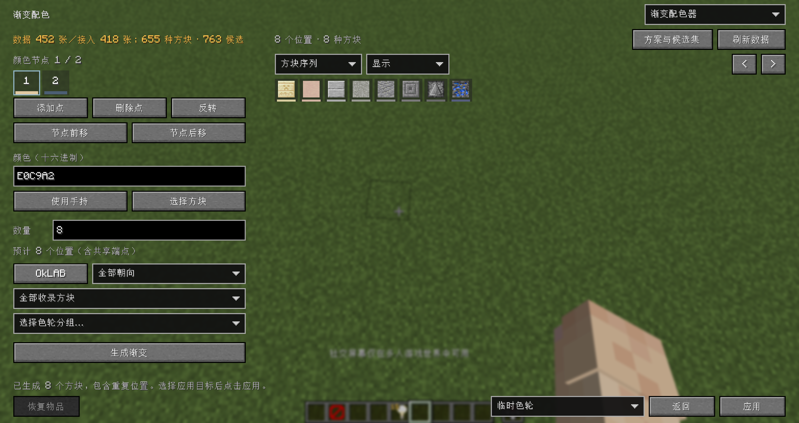
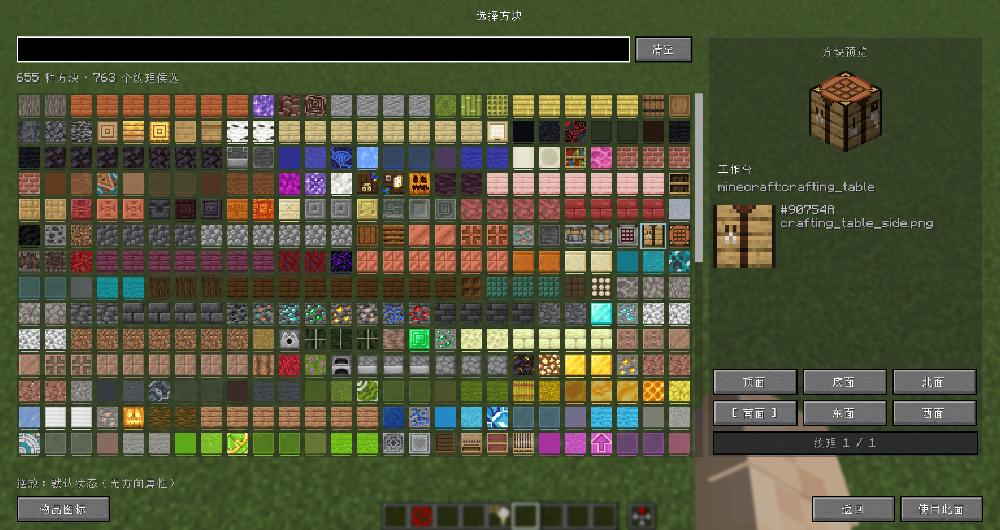
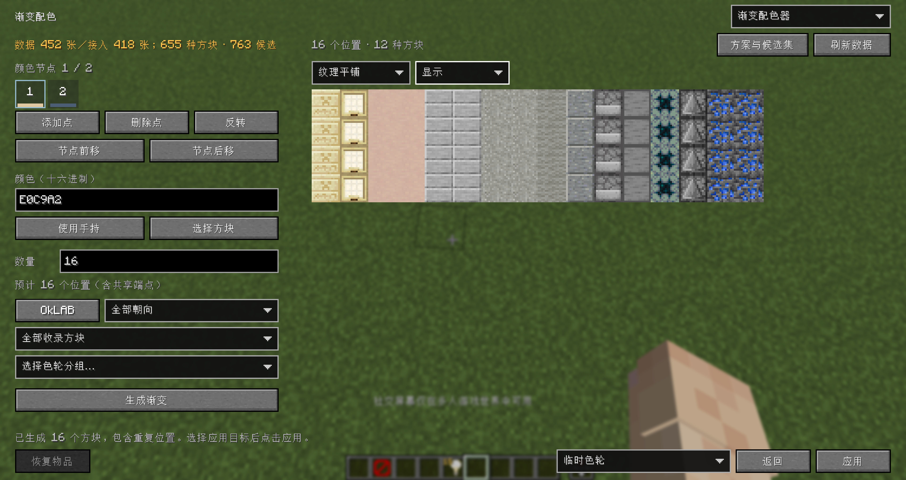

# 渐变配色教程

[返回 README](../README.md) · [色轮使用教程](PALETTE_GUIDE.md) · [English](GRADIENT_GUIDE_en.md)

想给墙面做一段由浅到深的过渡，又不想逐个翻物品栏找颜色，可以先用渐变配色器生成一组方块，再根据实际效果微调。

默认按 `P` 打开编辑器首页，选择 **渐变配色器**。正常窗口左侧是设置，右侧是结果；小窗口中使用 **设置／结果** 页签切换。

## 先生成一组渐变

1. 等待顶部提示配色数据就绪；首次使用需要联网下载，失败时可点击 **刷新数据** 重试
2. 点击第一个颜色节点，使用 **选择方块** 选一个浅色方块，例如砂岩，并在右侧选择要使用的面
3. 点击第二个节点，同样选择一个深色方块，例如深板岩
4. 回到第一个节点，将 **数量** 设为 `8`，先保留默认的 `OkLAB`
5. 如果是墙面配色，选择 **侧面** 筛选；点击 **生成渐变** 查看结果
6. 选择底部应用目标 **临时色轮**，点击 **应用**。退出编辑器后快速三连按 `R`，第三次按住，就可以切换这些方块

不需要完全照着示例选方块，也可以直接输入自己需要的颜色。实际打开临时色轮，以及应用到物品栏，需要处于创造模式。

## 设置颜色节点

节点决定渐变经过哪些颜色，最少 2 个，最多 16 个。点击节点格即可编辑，底部颜色线显示该节点的颜色。

- **颜色**：输入六位十六进制颜色，例如 `E0C9A2`，也可带 `#`
- **使用手持／选择方块**：从具体方块的匹配纹理取得颜色
- **数量**：表示从当前节点到下一个节点的一段，共生成多少个位置，包含两端；有效范围为 2–128，输入即生效
- 最后一个节点后面没有下一段，因此不需要填写数量

例如两个节点、数量为 `8`，结果是 8 个位置；三个节点、两段数量都为 `8`，由于中间端点共享，结果是 `8 + 8 - 1 = 15` 个位置。

这里的数量是**位置数**，不是不同方块数。相近的目标颜色可能匹配到同一种方块，出现重复是正常的。

### 调整节点顺序

- **添加点／删除点**：增加或移除节点
- **节点前移／节点后移**：移动当前节点，同时携带它的下一段数量
- **反转**：反转整条渐变，同时反转各段长度

有锁定结果时，增删、移动、反转节点或修改段数量会先提示清除锁定；取消则保留原来的参数和锁定。

## 选择方块与对应的面

**选择方块** 页面使用可滚动的方块网格，可以按名称、注册 ID 或纹理文件名搜索。默认展示匹配纹理，也可以切换为物品图标。

1. 点击一个方块，在右侧查看预览
2. 选择上、下、东、西、南、北等面；同一方向有多种可用纹理时，用左右按钮切换
3. 检查纹理、颜色和摆放属性，点击 **使用此面** 确认

选择面直接在右栏完成，不需要再打开一层页面。没有颜色数据，或被当前筛选排除的纹理可以预览，但不能用于当前匹配。

选择面决定使用哪张纹理参与配色，**不会替你修改世界中的方块朝向**。实际建造时仍需按需要摆放方块。

## 控制候选范围

- **色彩空间**：`OkLAB` 按感知颜色进行匹配，`RGB` 按颜色通道进行匹配，可以分别生成后比较效果
- **朝向**：做墙面可先选侧面，做地面可先选顶面，也可以指定方向
- **候选来源**：使用全部收录方块、HueBlocks 调色板，或自己指定的色轮分组
- **编辑候选集合**：手动排除不想使用的候选，红线表示已排除；支持搜索后批量操作

“当前分组”会记住你明确选定的层级和分组，不会因为切到色轮编辑器选择了另一组而偷偷改变。分组被删除时，需要重新选择。

修改参数后，旧结果仍会保留，但会提示需要重新生成。先点击 **生成渐变**，再继续应用。

## 微调单个结果

点击生成序列中的一个位置，进入微调面板，可以查看当前方块、目标颜色和锁定状态。

- 面板提供按颜色距离排序的前 8 个替代候选，不满意时可通过 **搜索更多** 继续选择
- 替换后会自动锁定这个位置；再次生成时，其他未锁定位置继续匹配，锁定位置保留
- 想让某个位置重新参与匹配，先解除锁定
- **设为颜色节点** 可以把选中的结果用于节点；**查看面** 可检查其不同面的纹理

锁定按完整序列中的位置记录。即使两个位置是同一种方块，也可以分别修改，不会一起变化。微调时会显示完整重复位置，便于确认正在修改哪一格。

修改颜色或色彩空间会保留锁定。如果新的筛选条件排除了锁定方块，界面会提示冲突；需要替换或解锁后才能生成、应用。

## 查看平铺与对比

### 纹理平铺

右侧视图切换到 **纹理平铺**，可以看到无间隙铺设的实际纹理。

- 在 **显示** 菜单中切换横向／纵向，以及 `16`、`24`、`32` 三档格子大小
- 沿渐变方向保留完整顺序和重复位置，另一方向重复 4 格；超出区域时滚动查看
- 普通方块序列可以隐藏连续重复项，这只是方便浏览，不会删掉实际生成的位置

平铺显示当前资源包的纹理，**颜色匹配仍使用 HueBlocks 数据**。它不模拟实景光照、生物群系染色或完整方块模型；正式使用前可以放到建筑里看一下效果。

### 保留结果作对比

1. 生成一组结果，在 **显示** 菜单中选择 **保留当前结果作对比**
2. 修改节点或筛选条件，再次生成
3. 选择 **查看结果对比**，同时查看前后两组结果

保留的结果不会随着后续参数修改而变化。再次保留会替换这份快照，退出编辑器后不保留。

## 应用结果

底部选择应用目标，再点击右下角 **应用**。

| 目标 | 结果与限制 |
| --- | --- |
| 临时色轮 | 保留完整顺序和重复位置，重启游戏后清空；创造模式下用三连按 `R` 打开 |
| 物品栏 | 创造模式可用，最多 36 个位置；先放入快捷栏，再放入主物品栏，超过容量不会截断应用 |
| 新建永久分组 | 按物品 ID 去重后创建色轮草稿，需要至少两个不同物品，再到色轮编辑器保存 |
| 替换分组 | 明确选择目标分组后替换草稿，同样需要至少两个不同物品，并手动保存 |

永久分组按物品去重，同一种方块的不同面不会保存成多个独立成员，也不会把预览中的摆放朝向保存为世界方块状态。

### 恢复原来的物品

应用到物品栏，或使用临时色轮替换手持物品后，可点击左下角 **恢复物品**。

- 只恢复被这些操作覆盖的槽位，保留原物品数量和组件
- 连续应用时保留首次覆盖前的备份，不会把上一组渐变当作原物品
- 备份只在当前玩家会话中有效，恢复后清空；退出服务器或玩家实例变化后不能继续使用

普通一级、二级色轮的物品切换不属于这份回滚备份。

## 保存参数，留到下次使用

在 **方案与候选集** 中，可以复制 JSON、保存新文件，或读取文件／剪贴板导入。

- **渐变参数**：保存节点颜色、方块纹理引用、段数量、色彩空间和筛选条件等；适合以后继续做同一套渐变
- **候选集合**：只保存筛选与排除项；适合反复使用一批限定的材料
- 文件位于 `config/lorian_arch_orbit/gradient-plans/`

生成结果、锁定位置、应用目标和对比快照不包含在参数文件中。导入渐变参数会提示替换当前参数并清除旧结果、锁定；导入候选集合保留节点和锁定，但需要重新生成。

## 关闭页面与数据说明

- 右上角菜单可以切换到色轮编辑器，右下角 **返回** 回到编辑器首页；同一次编辑中切页不会丢失参数
- `Esc` 直接退出编辑器；存在弹出菜单时先关闭菜单，未应用的渐变或未保存的色轮草稿会提示确认
- 成功应用当前渐变后不再提示这份结果尚未应用；但应用到永久分组产生的色轮草稿仍需 **保存**
- 编辑器不会自动保存整场编辑，下次还想继续使用参数时请主动导出

候选数量不等于 Minecraft 的方块总数：只有上游收录颜色、并能映射到当前游戏方块的纹理才会参与匹配，同一方块的不同面也可能占多个候选。朝向、调色板及自定义排除项都会继续影响数量。

配色数据会在客户端启动后后台检查更新；首次需要成功下载，之后网络异常时可继续使用有效缓存。更多说明见 [HueBlocks 数据与预设优化](HUEBLOCKS.md) 和 [配置文件与故障排查](../CONFIGURATION.md)。
