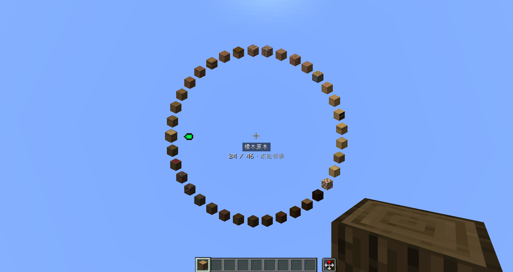
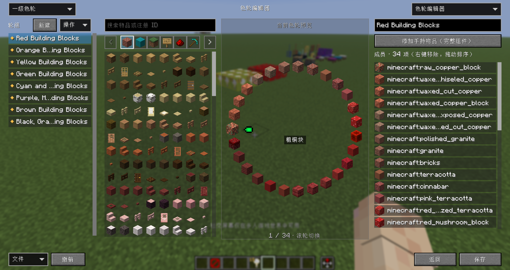

# 色轮使用教程

[返回 README](../README.md) · [渐变配色教程](GRADIENT_GUIDE.md) · [English](PALETTE_GUIDE_en.md)

把经常一起使用的方块放进同一个分组，建造时就可以通过滚轮快速切换，不用反复打开物品栏。

## 先试一下

1. 进入**创造模式**，手持一个在色轮分组中的方块，例如橡木原木
2. 按住 `R` 打开一级色轮，使用鼠标滚轮切换物品
3. 切到需要的方块后松开 `R`，继续建造

滚动时会立即替换当前快捷栏槽位中的物品，不需要额外点击确认。下面的按键均为默认值，可在 Minecraft 的按键设置中修改。

## 一级、二级和临时色轮

| 色轮 | 打开方式 | 用途 |
| --- | --- | --- |
| 一级色轮 | 按住 `R` | 常用的一组方块 |
| 二级色轮 | 快速按两次 `R`，第二次按住 | 为同一个方块准备另一套分组 |
| 临时色轮 | 快速按三次 `R`，第三次按住 | 使用渐变配色器生成的完整结果 |

- 一级与二级色轮根据**当前手持物品**寻找分组，需要分组中至少有两个有效的不同成员
- 两级可以分别选择 **同类方块、同系列方块、颜色分类** 预设，也可以在编辑器中自己搭配
- 临时色轮先在渐变配色器中生成并应用，之后即使空手也能打开；重复方块的位置会保留，重启游戏后清空

如果轮盘放不下全部成员，界面会显示“当前位置／总数”，继续滚动即可访问剩余物品，不会因为窗口变小丢失成员。

## 编辑自己的色轮

按 `P` 打开编辑器首页，选择 **色轮编辑器**。

正常窗口下，从左到右依次是 **分组、物品列表、色轮预览、成员列表**。小窗口中会改成对应的页签，功能不变。

### 新建一组

1. 在左上角选择 **一级色轮** 或 **二级色轮**
2. 点击分组列表上方的 **新建**，在右侧输入分组名称
3. 从物品列表中点击需要的物品；可以通过分类或搜索查找
4. 在右侧成员列表中调整顺序，检查中间的色轮预览
5. 点击右下角 **保存**，保存成功后仍会停留在当前页面

成员列表支持 **拖拽排序、右键移除**。如果要保留手持物品的自定义名称等组件，使用 **添加手持物品（完整组件）**。

### 管理分组

- 分组列表上方的 **操作** 菜单可以复制或删除当前分组
- 左下角 **撤销** 用于撤销草稿中的编辑
- **文件 → 恢复默认分组** 会影响一级、二级全部分组，操作前会提示确认

修改先留在草稿中，点击 **保存** 后才写入色轮配置。恢复默认也需要保存才会正式生效。

## 分享与导入

- 在 **文件 → 分享** 中勾选想分享的分组，填写名称，再复制分享码或导出 JSON
- 将分享码复制到剪贴板，或将 JSON 放进分享目录，再打开 **文件 → 导入**；选择分享包，检查分组数量及缺失成员提示
- 根据需要选择 **保留两者、替换现有、跳过导入** 三种冲突处理方式之一，再点击 **确认导入**
- 导入后的分组先进入草稿，检查无误后点击 **保存**

分享文件位于游戏目录的 `config/lorian_arch_orbit/palette-shares/`。分享的是色轮分组；渐变的节点和筛选条件需要在渐变配色器中另外导出。

## 调整显示

按 `O` 打开配置，可以调整色轮的显示与操作偏好：

- **目标物品的位置**：下方、上方、左侧或右侧，默认下方
- **箭头样式**：`Vanilla`、`Arrow`、`Pointer`、`None`，默认 `Vanilla`；`None` 不显示箭头
- 色轮及编辑页面会自动适配窗口大小和 GUI 缩放；成员较多时优先减少同时显示数量，仍可滚动查看全部成员

指示箭头指向将要切换的物品，选中方块会有轻微放大效果。箭头自身动效与轮盘转动分开，不会跟着轮盘旋转。

## 返回、切页与退出

- 右上角的页面菜单可以切换到 **渐变配色器**，右下角 **返回** 回到编辑器首页
- 切页或返回首页会保留当前草稿、搜索和编辑状态，不会自动保存
- 在色轮编辑器或渐变配色器中按 `Esc` 直接退出；有弹出菜单时先关闭菜单，有未保存或未应用内容时会提示确认

退出整个编辑器后，未保存的草稿不会保留。临时色轮及渐变物品备份有独立的生命周期，不会因为关闭编辑器而立即清空。

## 打不开色轮时

- 确认处于创造模式，且已启用 Mod 和相应色轮功能
- 一级、二级需要手持物品命中对应分组，并有至少两个有效的不同成员；临时色轮需要先从渐变配色器应用结果
- 双按、三连按需要快速连续操作，最后一次保持按住
- 检查按键冲突；Fabric 下与 Radial 使用相同按键时，满足色轮打开条件会优先打开本 Mod 的色轮

更多配置说明见 [配置文件与故障排查](../CONFIGURATION.md)。
